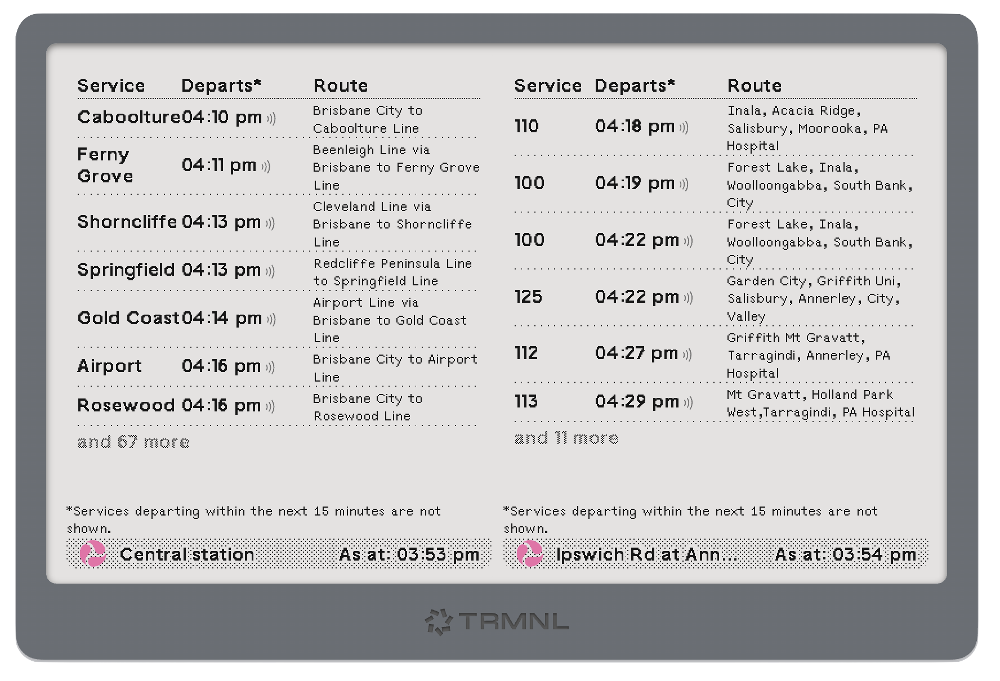

# trmnl-translink

A Translink Stop Timetable for a TRMNL eInk Device

Supports various screen layouts. 

## Setup

1. `brew install rbenv`
2. `brew install firefox@nightly`
3. `brew install ImageMagick`
4. `rbenv init`
5. `rbenv local`
6. `bundler install`  
7. `trmnlp login`
8. `trmnlp serve`
9. `trmnlp push`